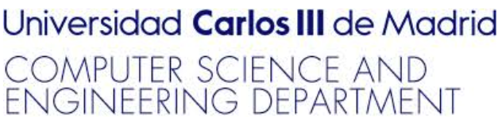

  
  
  
  
  

  
  

 

# A Simulation-Based Framework to Reduce I/O Contention in HPC

**Simone Pernice¹, Ahmad Tarraf², Jean-Baptiste Besnard³, Barbara Cantalupo¹, Alberto Cascajo⁴,**  
**David E. Singh⁴, Felix Wolf², Jesús Carretero⁴, Sameer Shende⁵, Marco Aldinucci¹**

¹ Department of Computer Science, University of Turin, Turin, Italy  
² Department of Computer Science, Technical University of Darmstadt, Darmstadt, Germany  
³ DataDirect Networks  
⁴ Computer Science and Engineering Department, University Carlos III of Madrid, Madrid, Spain  
⁵ ParaTools, Inc.

## Abstract

*Emerging hardware constraints are pushing workloads to become more composite. This transition involves new jobs where the HPC I/O systems are shared among multiple and concurrent jobs. This can generate load imbalances and contention in the end-to-end I/O paths, thus degrading the I/O system performance and the workloads. Recognizing this context, we define a simulation-based framework that alleviates resource contention in applications and ultimately allows us to design contention avoidance strategies. Specifically, by capturing behavior system-wide and extracting phases and characteristics of various performance metrics, we can mitigate contention by delaying the launch of applications. This framework leverages frequency domain analysis of performance metrics alongside clustering methods and is coupled with a comprehensive model of an HPC system implemented using Extended Stochastic Symmetric Nets.*

If you prefer to read the two pages abstract as a PDF, [click here](./abstract.pdf).

## Poster
You can view or download the full electronic copy of the poster:

👉 [**Download Poster (PDF)**](./poster.pdf)

---

